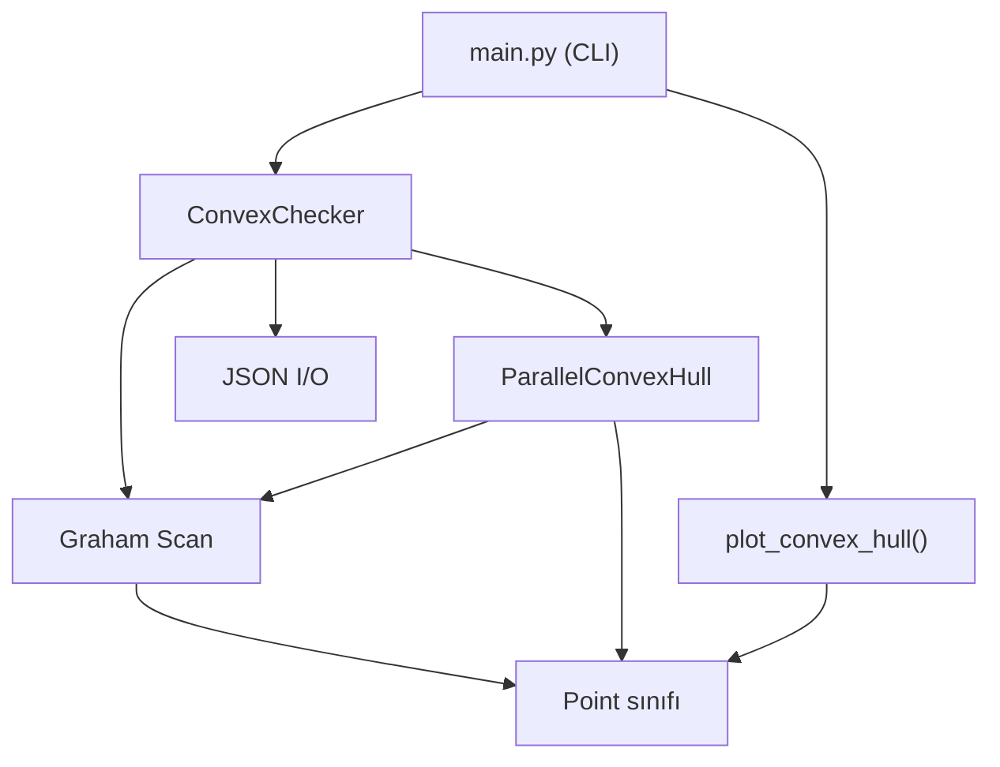

# 🔷 Parallel Convex Hull — Proje Kılavuzu

> Bu kılavuzu okuduktan sonra projenin ne yaptığını, nasıl çalıştığını ve kodun her parçasının neden var olduğunu başkasına tam olarak anlatabileceksiniz.

---

## 1. Bu Proje Ne Yapıyor?

Bu proje, **Convex Hull** adı verilen klasik bir bilgisayar bilimi problemini çözüyor.

### Convex Hull Nedir?

Bir düzlem üzerinde rastgele dağılmış noktalar hayal edin. Bu noktaların hepsini kapsayan en küçük **dışbükey çokgeni** (poligonu) bulmak istiyorsunuz. Bunu anlamanın en kolay yolu şu metafordur:

> 🪧 Bir tahtaya çivi çakın. Hepsinin etrafına lastik bir ip gerin ve bırakın. İpin sardığı çiviler, **convex hull** üzerindeki noktalardır.

**Görsel örnek:**
- İç noktalar (kırmızıya dahil değil): (1, 0.5), (0.5, 1), (1.5, 1.5)
- Hull (dışarıdan saran çerçeve): (0,0) → (2,0) → (2,2) → (0,2)

### Projenin Özel Katkısı: Paralellik

Bu proje sadece Convex Hull hesaplamıyor; bunu **hem tek thread ile (seri)** hem de **birden fazla thread kullanarak (paralel)** yapıp performansı karşılaştırıyor. Bu, **Paralel Programlama** dersinin konusu.

---

## 2. Proje Klasör Yapısı

```
parallel-convex-hull/
│
├── main.py                        ← Programın başlangıç noktası (CLI arayüzü)
├── requirements.txt               ← Gerekli Python kütüphaneleri
├── README.md                      ← GitHub'da görünen tanıtım sayfası
│
├── src/                           ← Kaynak kodların bulunduğu ana klasör
│   ├── __init__.py
│   ├── point.py                   ← Nokta sınıfı (temel veri yapısı)
│   ├── convex_checker.py          ← Ana kontrol sınıfı (hepsini bir araya getirir)
│   ├── thread_manager.py          ← Paralel hesaplama motoru
│   └── algorithms/
│       ├── __init__.py
│       ├── graham_scan.py         ← Algoritma 1: Graham Scan (O(n log n))
│       └── jarvis_march.py        ← Algoritma 2: Jarvis March (O(nh))
│
├── tests/                         ← Otomatik testler
│   ├── __init__.py
│   ├── test_algorithms.py         ← Graham Scan ve Jarvis March testleri
│   ├── test_convex.py             ← ConvexChecker sınıfı testleri
│   └── test_threading.py          ← Paralel işlem testleri
│
├── visualization/                 ← Grafik çizim modülü
│   ├── __init__.py
│   └── plotter.py                 ← Matplotlib ile hull çizimi
│
└── data/                          ← Veri dosyaları
    ├── generate_data.py           ← Test verisi üretme scripti
    └── sample_points.json         ← Hazır örnek nokta seti
```

---

## 3. Temel Veri Yapısı: `src/point.py`

Her şeyin temeli bu dosyadadır. Bir **2D nokta**yı temsil eden `Point` sınıfını tanımlar.

```python
p = Point(3.0, 5.0)  # x=3, y=5 olan bir nokta
```

### Point Sınıfının Yetenekleri

| Metot | Ne Yapar? | Örnek |
|---|---|---|
| `__init__(x, y)` | Nokta oluşturur | `Point(1, 2)` |
| `__eq__` | İki noktanın eşit olup olmadığını karşılaştırır | `p1 == p2` |
| `__hash__` | Noktanın set/dict içinde kullanılabilmesini sağlar | `{p1, p2}` |
| `__lt__` | Sıralama için büyük/küçük karşılaştırması | `sorted(points)` |
| `distance_to(other)` | İki nokta arası Euclidean mesafe | `p1.distance_to(p2)` |
| `orientation(p1, p2, p3)` | Üç noktanın dönüş yönünü bulur | `0=düz, 1=CW, 2=CCW` |
| `to_dict() / from_dict()` | JSON ile kayıt/yükleme için | `{"x": 1, "y": 2}` |

### En Kritik Fonksiyon: `orientation`

Bu fonksiyon, tüm algoritmalar için temeldir. Üç nokta verildiğinde, bu noktaların oluşturduğu dönüşün **saat yönünde mi, yoksa saat yönünün tersine mi** olduğunu söyler.

```
P1 ──── P2
           \
            P3
```
- Eğer P3, P1→P2 çizgisinin **solunda** ise: **Counter-Clockwise (2)** → Convex hull için doğru yön!
- Eğer **sağında** ise: **Clockwise (1)** → Bu nokta hull'ı bozuyor.
- Eğer **üzerinde** ise: **Collinear (0)** → Doğrusal, özel durum.

---

## 4. Algoritmalar

### 4.1 Graham Scan — `src/algorithms/graham_scan.py`

**Zaman Karmaşıklığı:** O(n log n)  
**En iyi olduğu durum:** Büyük nokta setleri

Bu projede kullanılan **ana algoritma**dır. Şu adımları izler:

#### Adım Adım Graham Scan

```
1. En alttaki (en küçük y koordinatlı) noktayı bul → Başlangıç noktası (pivot)

2. Diğer tüm noktaları, pivot'a göre kutupsal açıya göre sırala
   (saat yönünün tersine, soldaki en küçük açıdan başla)

3. Sıralanmış noktaları tek tek işle:
   - Yeni nokta mevcut hull'ı sola mı döndürüyor? → Ekle
   - Sağa mı döndürüyor? → Son noktayı çıkar, tekrar kontrol et

4. Kalan noktalar = Convex Hull
```

#### Neden Hızlı?
Çünkü sıralama O(n log n), ardından her nokta en fazla bir kez eklenir ve çıkarılır: O(n). Toplam: **O(n log n)**.

---

### 4.2 Jarvis March — `src/algorithms/jarvis_march.py`

**Zaman Karmaşıklığı:** O(n × h)  (h = hull üzerindeki nokta sayısı)  
**En iyi olduğu durum:** Hull üzerinde çok az nokta olduğunda

"Hediye paketleme" (gift wrapping) algoritması olarak da bilinir. Şu mantıkla çalışır:

#### Adım Adım Jarvis March

```
1. En sol noktadan başla (kesinlikle hull üzerinde)

2. Her adımda: tüm diğer noktalara bak
   "Şu anki noktamdan hangi yöne dönersem en sola dönmüş olurum?"
   → O nokta, hull'daki bir sonraki noktadır

3. Başlangıç noktasına geri dönene kadar devam et
```

> **Fark:** Graham Scan tüm noktaları önceden sıralar; Jarvis March her adımda tüm noktaları tarar. Bu yüzden Jarvis March hull küçükse daha iyi, büyükse daha kötü performans gösterir.

---

## 5. Paralel Hesaplama Motoru: `src/thread_manager.py`

Bu dosya, projenin **"paralel programlama"** kısmını içeriyor.

### Strateji: Böl ve Birleştir (Divide & Conquer)

```
Tüm noktalar (örn. 10.000 nokta)
        │
        ▼
┌─────────────────────────────────────────┐
│            x koordinatına göre sırala  │
└─────────────────────────────────────────┘
        │
   4 parçaya böl
   │         │         │         │
   ▼         ▼         ▼         ▼
[0-2500]  [2500-5000] [5000-7500] [7500-10000]
   │         │         │         │
Thread1   Thread2   Thread3   Thread4   ← Aynı anda çalışır!
   │         │         │         │
Hull1     Hull2     Hull3     Hull4
   │         │         │         │
   └────────┬┘         └────────┘
            │           │
         Birleştir    Birleştir
            │
            ▼
       Final Hull ✅
```

### `ParallelConvexHull` Sınıfı

```python
pch = ParallelConvexHull(num_threads=4)
result = pch.compute_parallel(points)
```

**Önemli optimizasyon:** 100'den az nokta varsa, paralel hesaplama yapmaz! Çünkü thread oluşturma maliyeti (overhead), kazancından fazla olur. Bu durumda doğrudan Graham Scan çalıştırır.

### `benchmark()` Metodu

```python
bench = pch.benchmark(points)
# Çıktı:
# {
#   'serial_time': 0.0032,    ← Tek thread ile süre
#   'parallel_time': 0.0011,  ← 4 thread ile süre
#   'speedup': 2.9,           ← Kaç kat hızlandı
#   'is_correct': True         ← İki sonuç aynı mı?
# }
```

---

## 6. Ana Kontrol Sınıfı: `src/convex_checker.py`

Bu sınıf, tüm modülleri bir araya getiren **koordinatör**dür.

```python
checker = ConvexChecker(use_parallel=True, num_threads=4)

# Noktaları ayarla
checker.set_points([Point(0,0), Point(1,0), Point(0.5,1)])

# Hull hesapla
hull = checker.compute_hull()

# Sorgular
checker.is_convex()        # True/False
checker.get_statistics()   # Detaylı istatistikler

# JSON ile çalış
checker.load_from_json("input.json")
checker.save_to_json("output.json")
```

### `is_convex()` Nasıl Çalışır?

Verilen nokta setindeki **tüm noktalar** hull üzerindeyse `True` döner. Yani "bu noktaların hepsi bir convex şekil oluşturuyor mu?" sorusunu yanıtlar.

---

## 7. Komut Satırı Arayüzü: `main.py`

Programı terminalden çalıştırmanın her yolu burada tanımlı.

### Kullanım Örnekleri

```bash
# En basit kullanım (demo verisi ile)
python main.py

# 1000 rastgele nokta ile çalıştır
python main.py --points 1000

# JSON dosyasından nokta yükle
python main.py --input data/sample_points.json

# 4 thread ile paralel modda çalıştır
python main.py --points 5000 --parallel --threads 4

# Paralel modu benchmark ile test et
python main.py --points 10000 --parallel --threads 4 --benchmark

# Sonucu görselleştir (convex_hull.png oluşturur)
python main.py --points 500 --visualize

# Tüm seçenekleri birlikte kullan
python main.py --input data/sample_points.json --parallel --threads 8 --visualize --benchmark --output sonuc.json
```

### Parametreler

| Parametre | Kısa | Açıklama | Varsayılan |
|---|---|---|---|
| `--input` | `-i` | Girdi JSON dosyası yolu | — |
| `--output` | `-o` | Çıktı JSON dosyası yolu | `output.json` |
| `--points` | `-p` | Üretilecek rastgele nokta sayısı | — |
| `--threads` | `-t` | Paralel modda kullanılacak thread sayısı | `4` |
| `--parallel` | — | Paralel modu aktif eder | `False` |
| `--visualize` | `-v` | Grafik PNG dosyası oluşturur | `False` |
| `--benchmark` | `-b` | Seri vs paralel karşılaştırması yapar | `False` |

---

## 8. Görselleştirme: `visualization/plotter.py`

Matplotlib kullanarak hull'u çizen iki fonksiyon içerir.

### `plot_convex_hull()`
```python
plot_convex_hull(
    points=tum_noktalar,    # Mavi: iç noktalar
    hull=hull_noktalar,     # Kırmızı: hull noktaları + çizgi
    save_path='hull.png',   # None ise ekranda gösterir
    title="Convex Hull"
)
```

### `plot_benchmark_comparison()`
Benchmark sonuçlarını yan yana iki grafik halinde gösterir:
- Sol: Seri vs Paralel süre (bar chart)
- Sağ: Hızlanma katsayısı (speedup)

---

## 9. Veri Formatı (JSON)

Hem girdi hem çıktı dosyaları aynı JSON formatını kullanır:

```json
{
  "points": [
    {"x": 0.0, "y": 0.0},
    {"x": 2.0, "y": 0.0},
    {"x": 2.0, "y": 2.0}
  ],
  "hull": [
    {"x": 0.0, "y": 0.0},
    {"x": 2.0, "y": 0.0}
  ],
  "is_convex": false,
  "point_count": 7,
  "hull_point_count": 4
}
```

---

## 10. Testler: `tests/` Klasörü

Pytest framework kullanılır. Her modülün kendi test dosyası var.

### Testleri Çalıştırma

```bash
# Tüm testleri çalıştır
pytest tests/

# Sadece algoritma testleri
pytest tests/test_algorithms.py

# Ayrıntılı çıktı ile
pytest tests/ -v
```

### Test Dosyaları

| Dosya | Ne Test Eder? |
|---|---|
| `test_algorithms.py` | Graham Scan ve Jarvis March'ın doğru hull bulup bulmadığı |
| `test_convex.py` | ConvexChecker sınıfının JSON, istatistik, paralel mod testleri |
| `test_threading.py` | Paralel sonuçların seri sonuçlarla aynı olup olmadığı |

---

## 11. Mimari: Modüller Nasıl Bağlanıyor?



**Veri akışı özeti:**
1. `main.py` → Kullanıcıdan komut alır
2. `ConvexChecker` → Hem seri hem paralel modun koordinatörü
3. `ParallelConvexHull` → Noktaları böler, thread'lere dağıtır, birleştirir
4. `graham_scan()` → Her thread içinde çalışan algoritma
5. `Point` → Tüm hesaplamaların üzerinde yapıldığı veri yapısı
6. `plotter.py` → Sonuçları görsel olarak sunar

---

## 12. Kurulum ve Çalıştırma

```bash
# 1. Repoyu indir
git clone https://github.com/demirbas1436/parallel-convex-hull.git
cd parallel-convex-hull

# 2. Kütüphaneleri kur
pip install -r requirements.txt

# 3. Demo çalıştır
python main.py

# 4. Testleri çalıştır
pytest tests/
```

**`requirements.txt` içeriği:**
- `matplotlib` → Grafik çizimi
- `numpy` → Sayısal işlemler (ileride kullanım için)
- `pytest` → Test framework

---

## 13. Önemli Tasarım Kararları

### Neden Graham Scan seçildi?
Graham Scan, genel amaçlı kullanım için en dengeli algoritmadır. O(n log n) ile büyük nokta setlerinde verimlidir. Jarvis March ek bir alternatif olarak eklendi ama ana algoritma Graham Scan'dır.

### Neden 100 nokta altında paralelleştirilmiyor?
Thread oluşturmak, senkronizasyon ve bölme/birleştirme adımları **sabit bir maliyet (overhead)** getirir. Az sayıda noktada bu maliyet, paralelden elde edilen kazancı geçer. Bu eşik değeri (100) deneysel olarak belirlenmiştir.

### Neden `set()` kullanılarak hull noktaları birleştiriliyor?
Partial hull'ların birleştirilmesinde kopyalanmış noktaların elenmesi gerekir. Python `set()` yapısı, `__hash__` ve `__eq__` metodları sayesinde bunu otomatik yapar. Bu nedenle `Point` sınıfında bu metodların doğru tanımlanması kritikti.

---

*Bu kılavuz, Parallel Convex Hull projesinin tüm bileşenlerini kapsamaktadır.*
